## 1.语法讲解

在typora输入的时候，都是按下面这个格式：

```
​````mermaid
语句部分
​````
```

下面讲解将直接显示语句部分：

### Graph声明方向

```
graph LR
    A --> B
```


这是声明一个水平向右的图，LR 就是属性之一。 A和B 只是obj
可能方向有：
TB 上下 BT 下上 RL 右左 LR 左右 TD 上下

### 节点与形状

#### 数字节点

```
 graph LR 
1
```

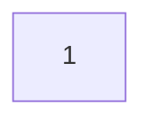

#### 文本节点

```
 graph LR 
id[这里输入的是文本]
```

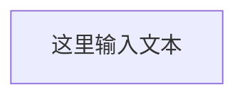

#### 圆角节点

```
 graph LR
id(这里输入的是文本)
```

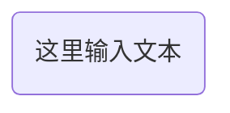

#### 圆节点

```
 graph LR
 id((这里输入的是文本))
```

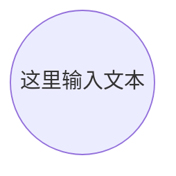

#### 非对称节点

```
 graph LR
 id>这里输入的文字]
```

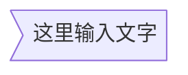

#### 菱形节点

```
graph LR
id{这里输入的是文本}
```

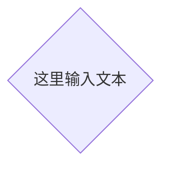

### 连接线

节点间的连接线有多种形状，而且可以在连接线中加入标签：

#### 箭头形连接

```
graph LR;
  A-->B;
```


#### 开放行连接

```
graph LR
A --- B
```

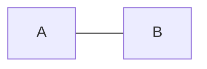

#### 标签连接

```
graph LR
A -- 标签文本--- B;
```

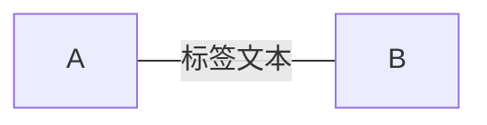

#### 箭头标签连接

```
graph LR
 A-- text -->B
```

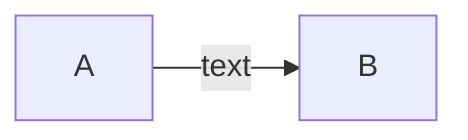

#### 虚线

```
graph LR
A-.->B
```

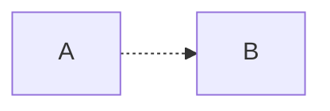

#### 虚线不带箭头

```
graph LR
A-.-B
```

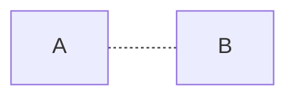

#### 标签虚线

```
graph LR
A-.text.->B
```

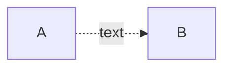

#### 粗实线

```
graph LR
A==>B
```

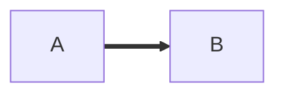

不带箭头粗线 A===B 标签粗线 A==text==>B

## 特殊的语法

文本换行

```wiki
A[Dependency<br>依赖关系基类]
```

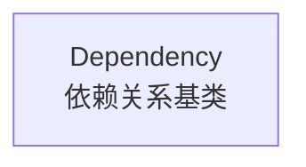

使用引号可以抑制一些特殊的字符的使用，可以避免一些不必要的麻烦。

```
graph LR
d1["This is the (text) in the box"]
```

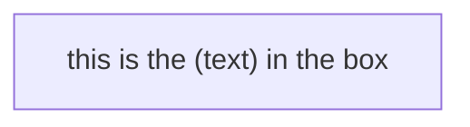

html字符的转义字符

```
graph LR
        A["A double quote:#quot;"]-->B["A dec char:#9829;"]
```

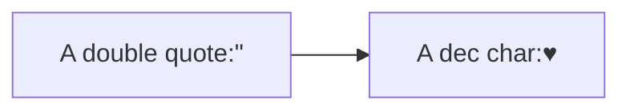

插入表情

如果想加入来自frontawesome的图表字体,需要像frontawesome网站上那样引用的那样

```
graph TD
      B["fa:fa-twitter 哈哈"]
      B-->C[fa:fa-ban 哈哈]
      B-->D(fa:fa-spinner);
      B-->E(A fa:fa-camera-retro 哈哈);
```

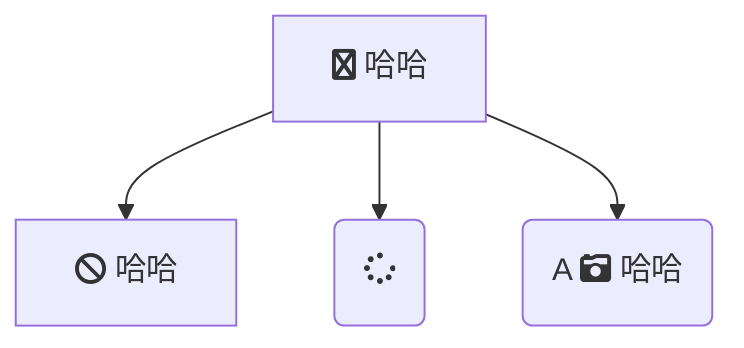

# 2.使用举例

## 流程图

```
graph LR
A-->B{条件a}
B-->|a=1|D[结果1]
B-->|a=2|E[结果2]
```

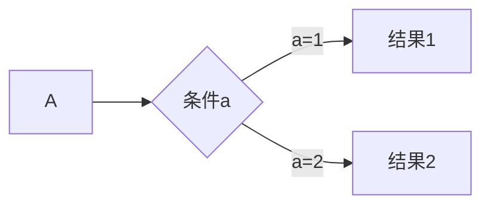
```
graph TD
A-->B{条件a}
B-->D
B-->E
```
```mermaid
graph TD
A-->B{条件a}
B-->D
B-->E
```
## 标准流程图
```
st=>start: 开始框
op=>operation: 处理框
cond=>condition: 判断框(是或否?)
sub1=>subroutine: 子流程
io=>inputoutput: 输入输出框
e=>end: 结束框
st->op->cond
cond(yes)->io->e
cond(no)->sub1(right)->op
```
```flow
st=>start: 开始框
op=>operation: 处理框
cond=>condition: 判断框(是或否?)
sub1=>subroutine: 子流程
io=>inputoutput: 输入输出框
e=>end: 结束框
st->op->cond
cond(yes)->io->e
cond(no)->sub1(right)->op
```

```
st=>start: 开始框
op=>operation: 处理框
cond=>condition: 判断框(是或否?)
sub1=>subroutine: 子流程
io=>inputoutput: 输入输出框
e=>end: 结束框
st(right)->op(right)->cond
cond(yes)->io(bottom)->e
cond(no)->sub1(right)->op
```

```flow
st=>start: 开始框
op=>operation: 处理框
cond=>condition: 判断框(是或否?)
sub1=>subroutine: 子流程
io=>inputoutput: 输入输出框
e=>end: 结束框
st(right)->op(right)->cond
cond(yes)->io(bottom)->e
cond(no)->sub1(right)->op
```
## UML时序图
```
IE->web: 发送登录请求
Note left of IE: 用户点击登录按钮
Note right of web: 进行权限校验
web-->IE:登录失败
IE-> web: what a fuck
```
```sequence
IE->web: 发送登录请求
Note left of IE: 用户点击登录按钮
Note right of web: 进行权限校验
web-->IE:登录失败
IE-> web: what a fuck
```

```
Title: 标题：复杂使用
对象A->对象B: 对象B你好吗?（请求）
Note right of 对象B: 对象B的描述
Note left of 对象A: 对象A的描述(提示)
对象B-->对象A: 我很好(响应)
对象B->小三: 你好吗
小三-->>对象A: 对象B找我了
对象A->对象B: 你真的好吗？
Note over 小三,对象B: 我们是朋友
participant C
Note right of C: 没人陪我玩
```

```sequence
Title: 标题：复杂使用
对象A->对象B: 对象B你好吗?（请求）
Note right of 对象B: 对象B的描述
Note left of 对象A: 对象A的描述(提示)
对象B-->对象A: 我很好(响应)
对象B->小三: 你好吗
小三-->>对象A: 对象B找我了
对象A->对象B: 你真的好吗？
Note over 小三,对象B: 我们是朋友
participant C
Note right of C: 没人陪我玩


```

```
%% 时序图例子,-> 直线，-->虚线，->>实线箭头
  sequenceDiagram
    participant 张三
    participant 李四
    张三->王五: 王五你好吗？
    loop 健康检查
        王五->王五: 与疾病战斗
    end
    Note right of 王五: 合理 食物 <br/>看医生...
    李四-->>张三: 很好!
    王五->李四: 你怎么样?
    李四-->王五: 很好!

```

```mermaid
%% 时序图例子,-> 直线，-->虚线，->>实线箭头
  sequenceDiagram
    participant 张三
    participant 李四
    张三->王五: 王五你好吗？
    loop 健康检查
        王五->王五: 与疾病战斗
    end
    Note right of 王五: 合理 食物 <br/>看医生...
    李四-->>张三: 很好!
    王五->李四: 你怎么样?
    李四-->王五: 很好!
```

```
%% 语法示例
        gantt
        dateFormat  YYYY-MM-DD
        title 软件开发甘特图
        section 设计
        需求                      :done,    des1, 2014-01-06,2014-01-08
        原型                      :active,  des2, 2014-01-09, 3d
        UI设计                     :         des3, after des2, 5d
   	未来任务                     :         des4, after des3, 5d
        section 开发
        学习准备理解需求                      :crit, done, 2014-01-06,24h
        设计框架                             :crit, done, after des2, 2d
        开发                                 :crit, active, 3d
        未来任务                              :crit, 5d
        耍                                   :2d
    
        section 测试
        功能测试                              :active, a1, after des3, 3d
        压力测试                               :after a1  , 20h
        测试报告                               : 48h
```


```mermaid
        gantt
        dateFormat  YYYY-MM-DD
        title Adding GANTT diagram functionality to mermaid

        section A section
        Completed task            :done,    des1, 2014-01-06,2014-01-08
        Active task               :active,  des2, 2014-01-09, 3d
        Future task               :         des3, after des2, 5d
        Future task2              :         des4, after des3, 5d

        section Critical tasks
        Completed task in the critical line :crit, done, 2014-01-06,24h
        Implement parser and jison          :crit, done, after des1, 2d
        Create tests for parser             :crit, active, 3d
        Future task in critical line        :crit, 5d
        Create tests for renderer           :2d
        Add to mermaid                      :1d

        section Documentation
        Describe gantt syntax               :active, a1, after des1, 3d
        Add gantt diagram to demo page      :after a1  , 20h
        Add another diagram to demo page    :doc1, after a1  , 48h

        section Last section
        Describe gantt syntax               :after doc1, 3d
        Add gantt diagram to demo page      : 20h
        Add another diagram to demo page    : 48h
```

# 参考

https://support.typora.io/Draw-Diagrams-With-Markdown/

https://github.com/huaxz1986/markdown_documentation_chinese/blob/master/markdown_syntax.md

https://www.zybuluo.com/codeep/note/163962