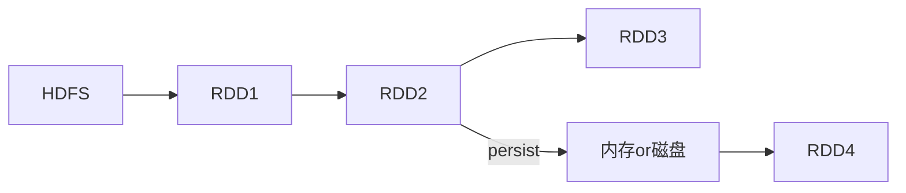

# 性能调优—总结

调优优先级

1. 分配资源、并行度、`rdd`架构与缓存
2. `shuffle`调优
3. `spark`算子调优
4. `jvm`调优、广播大变量等

## 资源分配

**分配哪些资源**

executor、cpu per executor、memory per executor、driver memory
在哪里分配这些资源？在我们在生产环境中，提交spark作业时，用的spark-submit shell脚本，里面调整对应的参数

/usr/local/spark/bin/spark-submit \
--class cn.spark.sparktest.core.WordCountCluster \
--num-executors 3 \  配置executor的数量
--driver-memory 100m \  配置driver的内存（影响不大）
--executor-memory 100m \  配置每个executor的内存大小
--executor-cores 3 \  配置每个executor的cpu core数量
/usr/local/SparkTest-0.0.1-SNAPSHOT-jar-with-dependencies.jar \

**调节到多大，算是最大呢**

一个原则，你能使用的资源有多大，就尽量去调节到最大的大小（executor的数量，几十个到上百个不等；executor内存；executor cpu core）

**为什么调节了资源以后，性能可以提升**

SparkContext，DAGScheduler，TaskScheduler，会将我们的算子，切割成大量的task，提交到Application的executor上面去执行。

- 增加executor：如果executor数量比较少，那么，能够并行执行的task数量就比较少，就意味着，我们的Application的并行执行的能力就很弱。比如有3个executor，每个executor有2个cpu core，那么同时能够并行执行的task，就是6个。6个执行完以后，再换下一批6个task。增加了executor数量以后，那么，就意味着，能够并行执行的task数量，也就变多了。比如原先是6个，现在可能可以并行执行10个，甚至20个，100个。那么并行能力就比之前提升了数倍，数十倍。相应的，性能（执行的速度），也能提升数倍~数十倍。
- 增加每个executor的cpu core，也是增加了执行的并行能力。原本20个executor，每个才2个cpu core。能够并行执行的task数量，就是40个task。现在每个executor的cpu core，增加到了5个。能够并行执行的task数量，就是100个task。执行的速度，提升了2.5倍
- 增加每个executor的内存量。增加了内存量以后，对性能的提升，有两点：
  - 如果需要对RDD进行cache，那么更多的内存，就可以缓存更多的数据，将更少的数据写入磁盘，甚至不写入磁盘。减少了磁盘IO。
  - 对于shuffle操作，reduce端，会需要内存来存放拉取的数据并进行聚合。如果内存不够，也会写入磁盘。如果给executor分配更多内存以后，就有更少的数据，需要写入磁盘，甚至不需要写入磁盘。减少了磁盘IO，提升了性能。
  - 对于task的执行，可能会创建很多对象。如果内存比较小，可能会频繁导致JVM堆内存满了，然后频繁GC，垃圾回收，minor GC和full GC。（速度很慢）。内存加大以后，带来更少的GC，垃圾回收，避免了速度变慢，速度变快了。

## 调节并行度

并行度：其实就是指的是，Spark作业中，各个stage的task数量，也就代表了**Spark作业的在各个阶段（stage）的并行度**。


合理的并行度的设置，应该是要设置的足够大，大到可以完全合理的利用你的集群资源；比如总共集群有150个cpu core，可以并行运行150个task。那么就应该将你的Application的并行度，至少设置成150，才能完全有效的利用你的集群资源，让150个task，并行执行；而且task增加到150个以后，即可以同时并行运行，还可以让每个task要处理的数据量变少；比如总共150G的数据要处理，如果是100个task，每个task计算1.5G的数据；现在增加到150个task，可以并行运行，而且每个task主要处理1G的数据就可以。

很简单的道理，只要合理设置并行度，就可以完全充分利用你的集群计算资源，并且减少每个task要处理的数据量，最终，就是提升你的整个Spark作业的性能和运行速度。

1、task数量，至少设置成与Spark application的总cpu core数量相同（最理想情况，比如总共150个cpu core，分配了150个task，一起运行，差不多同一时间运行完毕）

2、官方是推荐，**task数量，设置成spark application总cpu core数量的2~3倍**，比如150个cpu core，基本要设置task数量为300~500；

实际情况，与理想情况不同的，有些task会运行的快一点，比如50s就完了，有些task，可能会慢一点，要1分半才运行完，所以如果你的task数量，刚好设置的跟cpu core数量相同，可能还是会导致资源的浪费，因为，比如150个task，10个先运行完了，剩余140个还在运行，但是这个时候，有10个cpu core就空闲出来了，就导致了浪费。那如果task数量设置成cpu core总数的2~3倍，那么一个task运行完了以后，另一个task马上可以补上来，就尽量让cpu core不要空闲，同时也是尽量提升spark作业运行的效率和速度，提升性能。

3、如何设置一个Spark Application的并行度？
`spark.default.parallelism` 
`SparkConf conf = new SparkConf() .set("spark.default.parallelism", "500")`

## RDD架构重构与优化



默认情况下，多次对一个RDD执行算子，去获取不同的RDD，都会对这个RDD及之前的父RDD重新计算。如上图：在通过RDD2执行算子得到RDD3时，实际是从HDFS开始计算得到RDD1，然后从RDD1计算到RDD2，最后从RDD2执行算子到RDD3。如果在得到RDD2后执行`persist`操作，则对RDD2执行算子时不需要再从HDFS开始计算。

- 尽量去复用RDD，**差不多的RDD，可以抽取称为一个共同的RDD，供后面的RDD计算时，反复使用**。

- 公共RDD一定要实现持久化
- 当纯内存无法支撑公共RDD数据完全存放的时候，就优先考虑，使用序列化的方式在纯内存中存储。使用Kryo序列化是java默认序列化效率的10倍。使用序列化场景：
  - 算子函数中用到了外部变量
  - 持久化较大RDD 时（StorageLevel.MEMORY_ONLY_SER）
  - shuffle操作，shuffle时在节点与节点之间的task会互相大量通过网络拉取和传输文件

## 广播大变量

广播，Broadcast，将大变量广播出去。而不是直接使用。广播变量的好处，**不是每个task一份变量副本，而是变成每个节点的executor才一份副本**。这样的话，就可以让变量产生的副本大大减少。

广播变量，**初始的时候就在Drvier上有一份副本**。task在运行的时候，想要使用广播变量中的数据，此时首先会在自己本地的Executor对应的`BlockManager`中，尝试获取变量副本；如果本地没有，那么就从Driver远程拉取变量副本，并保存在本地的BlockManager中；此后这个executor上的task，都会直接使用本地的BlockManager中的副本。**executor的BlockManager除了从driver上拉取，也可能从其他节点的BlockManager上拉取变量副本，距离越近越好**。

举例来说，50个executor，1000个task。一个map，10M。默认情况下，1000个task，1000份副本。10G的数据，网络传输，在集群中，耗费10G的内存资源。如果使用了广播变量。50个execurtor，50个副本。500M的数据，网络传输，而且不一定都是从Driver传输到每个节点，还可能是就近从最近的节点的executor的bockmanager上拉取变量副本，网络传输速度大大增加；500M的内存消耗。10000M，500M，20倍。20倍~以上的网络传输性能消耗的降低；20倍的内存消耗的减少。

## 集合框架fastutil

fastutil是扩展了Java标准集合框架（Map、List、Set；HashMap、ArrayList、HashSet）的类库，提供了特殊类型的map、set、list和queue；例如：List<Integer> => IntList；**基本都是类似于IntList的格式，前缀就是集合的元素类型**；特殊的就是Map，**Int2IntMap**，代表了key-value映射的元素类型。除此之外，刚才也看到了，还支持object、reference。

**fastutil能够提供更小的内存占用，更快的存取速度**；我们使用fastutil提供的集合类，来替代自己平时使用的JDK的原生的Map、List、Set，好处在于，fastutil集合类，可以减小内存的占用，并且在进行集合的遍历、根据索引（或者key）获取元素的值和设置元素的值的时候，提供更快的存取速度；fastutil也**提供了64位的array、set和list**，以及高性能快速的，以及实用的IO类，来处理二进制和文本类型的文件；**fastutil最新版本要求Java 7以及以上版本**；

Spark中应用fastutil的场景：

- **算子函数使用了外部变量**；那么第一，你可以使用Broadcast广播变量优化；第二，可以使用Kryo序列化类库，提升序列化性能和效率；第三，如果外部变量是某种比较大的集合，那么可以考虑使用fastutil改写外部变量，首先从源头上就减少内存的占用，通过广播变量进一步减少内存占用，再通过Kryo序列化类库进一步减少内存占用。
- **算子函数使用了大集合**；在你的算子函数里，也就是task要执行的计算逻辑里面，如果有逻辑中，出现，要创建比较大的Map、List等集合，可能会占用较大的内存空间，而且可能涉及到消耗性能的遍历、存取等集合操作；那么此时，可以考虑将这些集合类型使用fastutil类库重写，使用了fastutil集合类以后，就可以在一定程度上，减少task创建出来的集合类型的内存占用。避免executor内存频繁占满，频繁唤起GC，导致性能下降。

## 数据本地化

Spark在Driver上，对Application的每一个stage的task，进行分配之前，都会计算出每个task要计算的是哪个分片数据，RDD的某个partition；**Spark的task分配算法，优先，会希望每个task正好分配到它要计算的数据所在的节点，这样的话，就不用在网络间传输数据**；

但是呢，通常来说，有时，事与愿违，可能task没有机会分配到它的数据所在的节点，为什么呢，可能那个节点的计算资源和计算能力都满了；所以呢，这种时候，通常来说，Spark会等待一段时间，默认情况下是3s钟（spark.locality.wait=3s），到最后，实在是等待不了了，就会选择一个比较差的本地化级别，比如说，将task分配到靠它要计算的数据所在节点，比较近的一个节点，然后进行计算。

但是对于第二种情况，通常来说，肯定是要发生数据传输，**task会通过其所在节点的BlockManager来获取数据**，BlockManager发现自己本地没有数据，会通过一个`getRemote()`方法，通过`TransferService`（网络数据传输组件）从数据所在节点的BlockManager中，获取数据，通过网络传输回task所在节点。

对于我们来说，当然不希望是类似于第二种情况的了。最好的，当然是task和数据在一个节点上，直接从本地executor的BlockManager中获取数据，纯内存，或者带一点磁盘IO；如果要通过网络传输数据的话，那么实在是，性能肯定会下降的，大量网络传输，以及磁盘IO，都是性能的杀手。

Task数据本地化级别：

- `PROCESS_LOCAL`：进程本地化，代码和数据在同一个进程中，也就是在同一个executor中；计算数据的task由executor执行，**数据在executor的BlockManager中**；性能最好
- `NODE_LOCAL`：节点本地化，代码和数据在同一个节点中；比如说，数据作为一个HDFS block块，就在节点上，而task在节点上某个executor中运行；或者是，数据和task在一个节点上的不同executor中；**数据需要在进程间进行传输**
- `NO_PREF`：对于task来说，数据从哪里获取都一样，没有好坏之分
- `RACK_LOCAL`：机架本地化，数据和task在一个机架的两个节点上；数据需要通过网络在节点之间进行传
- `ANY`：数据和task可能在集群中的任何地方，而且不在一个机架中，性能最差

**我们什么时候要调节这个参数？**

观察日志，spark作业的运行日志，大家在测试的时候，先用client模式，在本地就直接可以看到比较全的日志。
**日志里面会显示，starting task。。。，PROCESS LOCAL、NODE LOCAL**观察大部分task的数据本地化级别。

或者通过Driver的WEB UI查看 端口：4040

如果大多都是PROCESS_LOCAL，那就不用调节了,如果是发现，好多的级别都是NODE_LOCAL、ANY，那么最好就去调节一下数据本地化的等待时长,调节完，应该是要反复调节，每次调节完以后，再来运行，观察日志
看看大部分的task的本地化级别有没有提升；看看，整个spark作业的运行时间有没有缩短。

**怎么调节？**

默认是3s；
```
spark.locality.wait
spark.locality.wait.process
spark.locality.wait.node
spark.locality.wait.rack
```

## JVM调优

**降低cache操作的内存占比**

调节参数：`spark.storage.memoryFraction，0.6 -> 0.5 -> 0.4 -> 0.2`

**spark中，堆内存又被划分成了两块儿，一块儿是专门用来给RDD的cache、persist操作进行RDD数据缓存用的**；**另外一块儿，就是我们刚才所说的，用来给spark算子函数的运行使用的，存放函数中自己创建的对象**。

**默认情况下，给RDD cache操作的内存占比，是0.6，60%的内存都给了cache操作了**。但是问题是，如果某些情况下，cache不是那么的紧张，问题在于task算子函数中创建的对象过多，然后内存又不太大，导致了频繁的minor gc，甚至频繁full gc，导致spark频繁的停止工作。性能影响会很大。

针对上述这种情况，大家可以在之前我们讲过的那个spark ui。yarn去运行的话，那么就通过yarn的界面，去查看你的spark作业的运行统计，很简单，大家一层一层点击进去就好。可以看到每个stage的运行情况，包括每个task的运行时间、gc时间等等。如果发现gc太频繁，时间太长。此时就可以适当调价这个比例。

降低cache操作的内存占比，大不了用persist操作，选择将一部分缓存的RDD数据写入磁盘，或者序列化方式，配合Kryo序列化类，减少RDD缓存的内存占用；降低cache操作内存占比；对应的，算子函数的内存占比就提升了。这个时候，可能，就可以减少minor gc的频率，同时减少full gc的频率。对性能的提升是有一定的帮助的。

**设置堆外内存大小**

调节参数：`--conf spark.yarn.executor.memoryOverhead`

有时候，如果你的spark作业处理的数据量特别特别大，几亿数据量；然后spark作业一运行，时不时的报错，shuffle file cannot find，executor、task lost，out of memory（内存溢出）；

可能是说executor的堆外内存不太够用，导致executor在运行的过程中，可能会内存溢出；然后可能导致后续的stage的task在运行的时候，可能要从一些executor中去拉取shuffle map output文件，但是executor可能已经挂掉了，关联的block manager也没有了；所以可能会报shuffle output file not found；resubmitting task；executor lost；spark作业彻底崩溃。

**调节连接的超时时长**

调节参数：`--conf spark.core.connection.ack.wait.timeout=300`

executor，优先从自己本地关联的BlockManager中获取某份数据,如果本地block manager没有的话，那么会通过TransferService，去远程连接其他节点上executor的block manager去获取。尝试建立远程的网络连接时，对方executor正在进行jvm.gc。此时呢，就会没有响应，无法建立网络连接；会卡住，spark默认的网络连接的超时时长，是60s；如果卡住60s都无法建立连接的话，那么就宣告失败了。

## **Shuffle调优**

**`spark.shuffle.file.buffer`**

- 默认值：32k
- 参数说明：该参数用于设置shuffle write task的BufferedOutputStream的buffer缓冲大小。将数据写到磁盘文件之前，会先写入buffer缓冲中，待缓冲写满之后，才会溢写到磁盘。
- 调优建议：如果作业可用的内存资源较为充足的话，可以适当增加这个参数的大小（比如64k），从而减少shuffle write过程中溢写磁盘文件的次数，也就可以减少磁盘IO次数，进而提升性能。在实践中发现，合理调节该参数，性能会有1%~5%的提升。

**`spark.reducer.maxSizeInFlight`**

- 默认值：48m
- 参数说明：该参数用于设置shuffle read task的buffer缓冲大小，而这个buffer缓冲决定了每次能够拉取多少数据。
- 调优建议：如果作业可用的内存资源较为充足的话，可以适当增加这个参数的大小（比如96m），从而减少拉取数据的次数，也就可以减少网络传输的次数，进而提升性能。在实践中发现，合理调节该参数，性能会有1%~5%的提升。

**`spark.shuffle.io.maxRetries`**

- 默认值：3
- 参数说明：shuffle read task从shuffle write task所在节点拉取属于自己的数据时，如果因为网络异常导致拉取失败，是会自动进行重试的。该参数就代表了可以重试的最大次数。如果在指定次数之内拉取还是没有成功，就可能会导致作业执行失败。
- 调优建议：对于那些包含了特别耗时的shuffle操作的作业，建议增加重试最大次数（比如60次），以避免由于JVM的full gc或者网络不稳定等因素导致的数据拉取失败。在实践中发现，对于针对超大数据量（数十亿~上百亿）的shuffle过程，调节该参数可以大幅度提升稳定性。

 **`spark.shuffle.io.retryWait`**

- 默认值：5s
- 参数说明：具体解释同上，该参数代表了每次重试拉取数据的等待间隔，默认是5s。
- 调优建议：建议加大间隔时长（比如60s），以增加shuffle操作的稳定性。

**`spark.shuffle.memoryFraction`**

- 默认值：0.2
- 参数说明：该参数代表了Executor内存中，分配给shuffle read task进行聚合操作的内存比例，默认是20%。
- 调优建议：在资源调优中讲解过这个参数。如果内存充足，而且很少使用持久化操作，建议调高这个比例，给shuffle read的聚合操作更多内存，以避免由于内存不足导致聚合过程中频繁读写磁盘。在实践中发现，合理调节该参数可以将性能提升10%左右。

**`spark.shuffle.manager`**

- 默认值：sort
- 参数说明：该参数用于设置ShuffleManager的类型。Spark 1.5以后，有三个可选项：hash、sort和tungsten-sort。HashShuffleManager是Spark 1.2以前的默认选项，但是Spark 1.2以及之后的版本默认都是SortShuffleManager了。tungsten-sort与sort类似，但是使用了tungsten计划中的堆外内存管理机制，内存使用效率更高。
- 调优建议：由于SortShuffleManager默认会对数据进行排序，因此如果你的业务逻辑中需要该排序机制的话，则使用默认的SortShuffleManager就可以；而如果你的业务逻辑不需要对数据进行排序，那么建议参考后面的几个参数调优，通过bypass机制或优化的HashShuffleManager来避免排序操作，同时提供较好的磁盘读写性能。这里要注意的是，tungsten-sort要慎用，因为之前发现了一些相应的bug。

**`spark.shuffle.sort.bypassMergeThreshold`**

- 默认值：200
- 参数说明：当ShuffleManager为SortShuffleManager时，如果shuffle read task的数量小于这个阈值（默认是200），则shuffle write过程中不会进行排序操作，而是直接按照未经优化的HashShuffleManager的方式去写数据，但是最后会将每个task产生的所有临时磁盘文件都合并成一个文件，并会创建单独的索引文件。
- 调优建议：当你使用SortShuffleManager时，如果的确不需要排序操作，那么建议将这个参数调大一些，大于shuffle read task的数量。那么此时就会自动启用bypass机制，map-side就不会进行排序了，减少了排序的性能开销。但是这种方式下，依然会产生大量的磁盘文件，因此shuffle write性能有待提高。

**`spark.shuffle.consolidateFiles`**

- 默认值：false
- 参数说明：如果使用HashShuffleManager，该参数有效。如果设置为true，那么就会开启consolidate机制，会大幅度合并shuffle write的输出文件，对于shuffle read task数量特别多的情况下，这种方法可以极大地减少磁盘IO开销，提升性能。
- 调优建议：如果的确不需要SortShuffleManager的排序机制，那么除了使用bypass机制，还可以尝试将spark.shffle.manager参数手动指定为hash，使用HashShuffleManager，同时开启consolidate机制。在实践中尝试过，发现其性能比开启了bypass机制的SortShuffleManager要高出10%~30%。

## 算子调优

**`MapPartitions`**

如果是普通的map，比如一个partition中有1万条数据；ok，那么你的function要执行和计算1万次。但是，使用MapPartitions操作之后，一个task仅仅会执行一次function，function一次接收所有的partition数据。只要执行一次就可以了，性能比较高。但是如果数据量较大容易导致OOM。

在项目中，自己先去估算一下RDD的数据量，以及每个partition的量，还有自己分配给每个executor的内存资源。看看一下子内存容纳所有的partition数据，行不行。如果行，可以试一下，能跑通就好。性能肯定是有提升的。

**`coalesce`**

合并partition。主要就是用于在filter操作之后，针对每个partition的数据量各不相同的情况，来压缩partition的数量。减少partition的数量，而且让每个partition的数据量都尽量均匀紧凑。

**`foreachPartitions`**

foreach在写数据库时，是一条一条进入的，每次进入都会创建一次数据库链接。foreachPartitions是一次传入所有partitions的数据，只需建立一次数据库链接。

**`repartition`**

可通过`spark.default.parallelism`参数设置stage的并行度，但是在有sparkSql的stage中，其并行度是根据hive表对应的hdfs文件的block,自动设置sparkSql查询所在stage的并行度的，所以我们设置的`spark.default.parallelism`参数此时是无效的。

`repartition`算子，你用Spark SQL这一步的并行度和task数量，肯定是没有办法去改变了。但是呢，可以将你用Spark SQL查询出来的RDD，使用`repartition`算子，去重新进行分区，此时可以分区成多个partition，比如从20个partition，分区成100个。然后呢，从repartition以后的RDD，再往后，并行度和task数量，就会按照你预期的来了。就可以避免跟Spark SQL绑定在一个stage中的算子，只能使用少量的task去处理大量数据以及复杂的算法逻辑。

**`reduceByKey`**

`reduceByKey`相较于普通的shuffle操作（比如`groupByKey`），它的一个特点，就是说，会进行map端的本地聚合。对map端给下个stage每个task创建的输出文件中，写数据之前，就会进行本地的combiner操作，也就是说对每一个key，对应的values，都会执行你的算子函数（) + _）


## **参考链接**

https://www.iteblog.com/archives/1672.html

shuffle manager: https://cloud.tencent.com/developer/article/1336602


