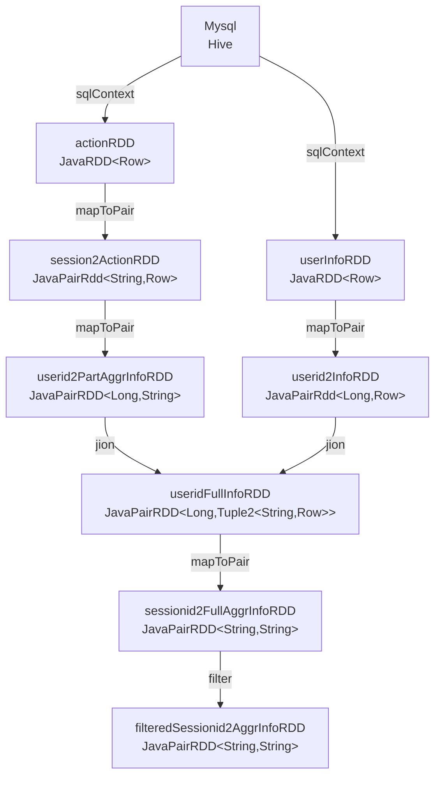
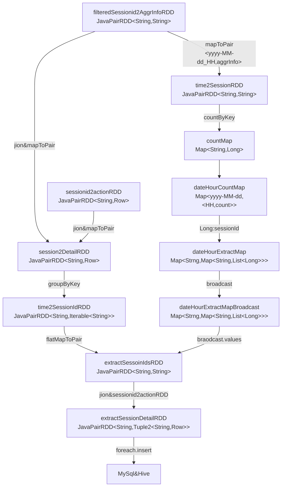
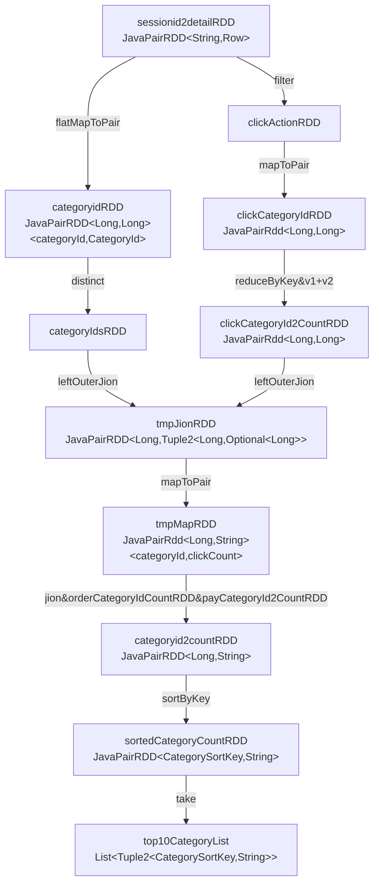
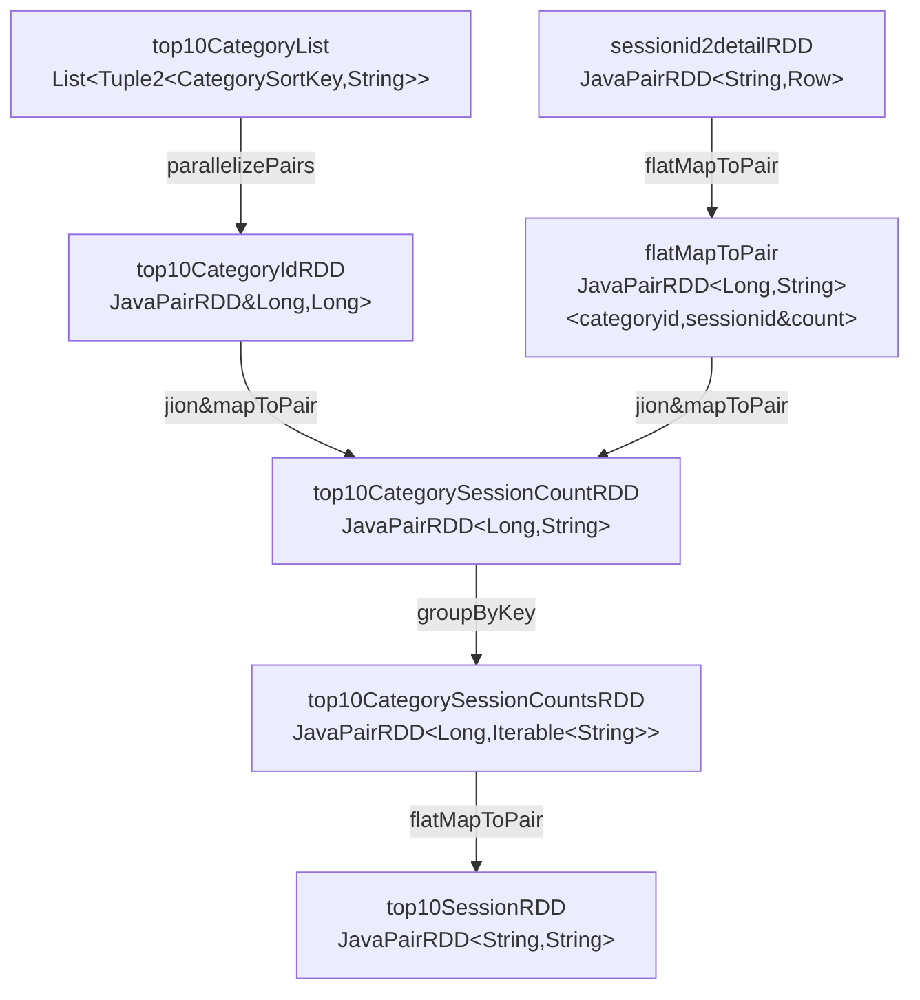
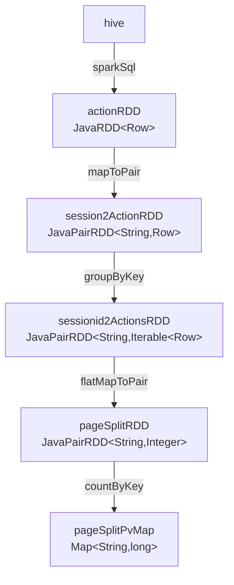

# session analysis 

## 按条件过滤

```mermaid
graph TD
A[Mysql<br>Hive]-->|sqlContext|B[actionRDD<br>JavaRDD&ltRow&gt]
B-->|mapToPair|C[session2ActionRDD<br>JavaPairRdd&ltString,Row&gt]
C-->|mapToPair|D[userid2PartAggrInfoRDD<br>JavaPairRDD&ltLong,String&gt]
A-->|sqlContext|E[userInfoRDD<br>JavaRDD&ltRow&gt]
E-->|mapToPair|F[userid2InfoRDD<br>JavaPairRdd&ltLong,Row&gt]
D-->|jion|G[useridFullInfoRDD<br>JavaPairRDD&ltLong,Tuple2&ltString,Row&gt&gt]
F-->|jion|G
G-->|mapToPair|H[sessionid2FullAggrInfoRDD<br>JavaPairRDD&ltString,String&gt]
H-->|filter|I[filteredSessionid2AggrInfoRDD<br>JavaPairRDD&ltString,String&gt]
```

## 按比例抽取

```mermaid
graph TD
A[filteredSessionid2AggrInfoRDD<br>JavaPairRDD&ltString,String&gt]-->|jion&mapToPair|B[session2DetailRDD<br>JavaPairRDD&ltString,Row&gt]
C[sessionid2actionRDD<br>JavaPairRDD&ltString,Row&gt]-->|jion&mapToPair|B
A-->|mapToPair<br>&ltyyyy-MM-dd_HH,aggrInfo&gt|D[time2SessionRDD<br>JavaPairRDD&ltString,String&gt]
D-->|countByKey|E[countMap<br>Map&ltString,Long&gt]
E-->F[dateHourCountMap<br>Map&ltyyyy-MM-dd,&ltHH,count&gt&gt]
F-->|Long:sessionId|H[dateHourExtractMap<br>Map&ltStrng,Map&ltString,List&ltLong&gt&gt&gt]
H-->|broadcast|I[dateHourExtractMapBroadcast<br>Map&ltStrng,Map&ltString,List&ltLong&gt&gt&gt]
B-->|groupByKey|J[time2SessionIdRDD<br>JavaPairRDD&ltString,Iterable&ltString&gt&gt]
J-->|flatMapToPair|K[extractSessoinIdsRDD<br>JavaPairRDD&ltString,String&gt]
I-->|braodcast.values|K
K-->|jion&sessionid2actionRDD|M[extractSessionDetailRDD<BR>JavaPairRDD&ltString,Tuple2&ltString,Row&gt&gt]
M-->|foreach.insert|L[MySql&Hive]
```

## 热门品类

```mermaid
graph TD
A[sessionid2detailRDD<br>JavaPairRDD&ltString,Row&gt]-->|flatMapToPair|B[categoryidRDD<br>JavaPairRDD&ltLong,Long&gt<br>&ltcategoryId,CategoryId&gt]
B-->|distinct|C[categoryIdsRDD]
A-->|filter|D[clickActionRDD<br>]
D-->|mapToPair|E[clickCategoryIdRDD<br>JavaPairRdd&ltLong,Long&gt]
E-->|reduceByKey&v1+v2|F[clickCategoryId2CountRDD<br>JavaPairRdd&ltLong,Long&gt]
C-->|leftOuterJion|H[tmpJionRDD<br>JavaPairRDD&ltLong,Tuple2&ltLong,Optional&ltLong&gt&gt]
F-->|leftOuterJion|H
H-->|mapToPair|I[tmpMapRDD<br>JavaPairRdd&ltLong,String&gt<br>&ltcategoryId,clickCount&gt]
I-->|jion&orderCategoryIdCountRDD&payCategoryId2CountRDD|J[categoryid2countRDD<br>JavaPairRDD&ltLong,String&gt]
J-->|sortByKey|K[sortedCategoryCountRDD<br>JavaPairRDD&ltCategorySortKey,String&gt]
K-->|take|M[top10CategoryList<br>List&ltTuple2&ltCategorySortKey,String&gt&gt]
```

## 热品活跃Session

```mermaid
graph TD

A[top10CategoryList<br>List&ltTuple2&ltCategorySortKey,String&gt&gt]-->|parallelizePairs|B[top10CategoryIdRDD<br>JavaPairRDD&Long,Long&gt]
C[sessionid2detailRDD<br>JavaPairRDD&ltString,Row&gt]-->|flatMapToPair|D[flatMapToPair<br>JavaPairRDD&ltLong,String&gt<br>&ltcategoryid,sessionid&count&gt]
B-->|jion&mapToPair|E[top10CategorySessionCountRDD<br>JavaPairRDD&ltLong,String&gt]
D-->|jion&mapToPair|E
E-->|groupByKey|F[top10CategorySessionCountsRDD<br>JavaPairRDD&ltLong,Iterable&ltString&gt&gt]
F-->|flatMapToPair|J[top10SessionRDD<br>JavaPairRDD&ltString,String&gt]
```

## 页面单跳转化率

```mermaid
graph TD 
A[hive]
A-->|sparkSql|B[actionRDD<br>JavaRDD&ltRow&gt]
B-->|mapToPair|C[session2ActionRDD<br>JavaPairRDD&ltString,Row&gt]
C-->|groupByKey|D[sessionid2ActionsRDD<br>JavaPairRDD&ltString,Iterable&ltRow&gt]
D-->|flatMapToPair|E[pageSplitRDD<br>JavaPairRDD&ltString,Integer&gt]
E-->|countByKey|F[pageSplitPvMap<br>Map&ltString,long&gt]

```

 