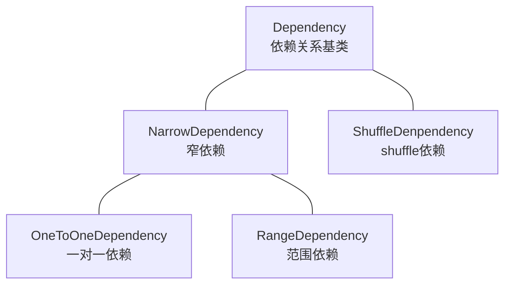

## 1.1 什么是RDD

从三方面阐述什么事RDD，即RDD的背景，定义和特点。

rdd的产生是为了提高计算速度，提高比MapReduce更加灵活的操作，以及更好的容错方式。为了实现这三个目标，RDD设置成了一个弹性分布式数据集，但是其并不记录数据，而是记录了数据的转换过程，并且将整个转换过程序列化后，在多个机器上对RDD的不同partition进行并行计算。这种方式相比传统的记录数据检查点或者更新情况而言，在集群中有更高效的数据传输。通过缓存机制可以减少转换操作的计算次数，通过血缘关系来解决数据丢失问题。因此RDD具备了：只读，分片，分区，并行计算，持久化和容错的特点。

### 1.1.1 产生背景

当初设计RDD主要是为了解决三个问题：提供计算速度，提供比MapReduce更灵活的操作，通过lineage实现容错。

- **Fast**:提高计算速度。 Spark之前的Hadoop用的是MapReduce的编程模型，没有很好的利用分布式内存系统，中间结果都需要保存到external disk，运行效率很低。RDD模型是in-memory computing的，中间结果不需要被物化（materialized），它的**persistence**机制，可以保存中间结果重复使用，**对需要迭代运算的机器学习应用和交互式数据挖掘应用，加速显著**。Spark快还有一个原因是开头提到过的**Delay Scheduling**机制，它得益于RDD的Dependency设计。
- **General**: 提供比MapReduce更灵活的操作。编程模型只能提供有限的运算种类（Map和Reduce），RDD希望支持更广泛更多样的operators（map，flatMap，filter等等），然后用户可以任意地组合他们。

> The ability of RDDs to accommodate computing needs that were previously met only by introducing new frameworks is, we believe, the most credible evidence of the power of the RDD abstraction.

- **Fault tolerance**: 通过Lineage实现容错。其他的in-memory storage on clusters，基本单元是可变的，用细粒度更新（**fine-grained updates**）方式改变状态，如改变table/cell里面的值，这种模型的容错只能通过复制多个数据copy，需要传输大量的数据，容错效率低下。而RDD是**不可变的（immutable）**，通过粗粒度变换（**coarse-grained transformations**），比如map，filter和join，可以把相同的运算同时作用在许多数据单元上，这样的变换只会产生新的RDD而不改变旧的RDD。这种模型可以让Spark用**Lineage**很高效地容错（后面会有介绍）。

### 1.1.2 **RDD定义**

```wiki
A Resilient Distributed Dataset (RDD), the basic abstraction in Spark. Represents（代表） an immutable(不变的),partitioned collection of elements that can be operated on in parallel
```

RDD是spark的核心，也是整个spark的架构基础，RDD是弹性分布式集合（`Resilient Distributed Datasets`）的简称。

### 1.1.3 **RDD特点**

- immutable：只读，任何操作都不会改变RDD本身，只会创造新的RDD，例如map操作，将MapRdd转换为MapPartitionsRdd
- fault-tolerant：容错，通过Lineage可以高效容错
- partitioned：分片，RDD以partition作为最小存储和计算单元，分布在cluster的不同nodes上，一个node可以有多个partitions，一个partition只能在一个node上
- in parallel：并行，一个Task对应一个partition，Tasks之间相互独立可以并行计算

- persistence：持久化，用户可以把会被重复使用的RDDs保存到storage上（内存或者磁盘）
- partitioning：分区，用户可以选择RDD元素被partitioned的方式来优化计算，比如两个需要被join的数据集可以用相同的方式做hash-partitioned，这样可以减少shuffle提高性能

### 1.1.4 **RDD抽象概念**

**一个RDD定义了对数据的一个操作过程, 用户提交的计算任务可以由多个RDD构成**。多个RDD可以是对单个/多个数据的多个操作过程。多个RDD之间的关系使用依赖来表达。操作过程就是用户自定义的函数。

RDD(弹性分布式数据集)去掉形容词，主体为：数据集。如果认为RDD就是数据集，那就有点理解错了。个人认为：RDD是定义对partition数据项转变的高阶函数，应用到输入源数据，输出转变后的数据，即：**RDD是一个数据集到另外一个数据集的映射，而不是数据本身。** 这个概念类似数学里的函数`f(x) = ax^2 + bx + c`。这个映射函数可以被序列化，所要被处理的数据被分区后分布在不同的机器上，应用一下这个映射函数，得出结果，聚合结果。

这些集合是弹性的，如果数据集一部分丢失，则可以对它们进行重建。具有自动容错、位置感知调度和可伸缩性，而容错性是最难实现的，**大多数分布式数据集的容错性有两种方式：数据检查点和记录数据的更新**。对于大规模数据分析系统，数据检查点操作成本高，主要原因是大规模数据在服务器之间的传输带来的各方面的问题，相比记录数据的更新，RDD也只支持粗粒度的转换共享状态而非细粒度的更新共享状态，也就是**记录**如何从其他RDD**转换**而来(即lineage)，以便恢复丢失的分区。 

RDDs 非常适合将相同操作应用在整个数据集的所有的元素上的批处理应用. 在这些场景下, RDDs 可以利用血缘关系图来高效的记住每一个 transformations 的步骤, 并且不需要记录大量的数据就可以恢复丢失的分区数据. RDDs 不太适合用于需要异步且细粒度的更新共享状态的应用, 比如一个 web 应用或者数据递增的 web 爬虫应用的存储系统。

## 1.2 RDD特点

```wiki
Internally, each RDD is characterized by five main properties:
- A list of partitions
- A function for computing each split
- A list of dependencies on other RDDs
- Optionally, a Partitioner for key-value RDDs (e.g. to say that the RDD is hash-partitioned)
- Optionally, a list of preferred locations to compute each split on (e.g. block locations for an HDFS file)
```

每个特性都对应RDD.scala中的一个方法实现：

- `a list of partition`  由多个机器里面的partition组成的

- `a function for computing each split`  并行计算 

- `a list of dependencies on other RDDS` rdd间存在依赖关系,记录数据转换间的依赖

- `a partitioner for key-vaue` RDDS 可进行重新分区（只有key value的partition有）

- `a list of preferred locations to compute each spilt on`  用最期望的位置进行计算

## 1.3 RDD操作

### 1.3.1 RDD创建

1. `parallelize`:从普通Scala集合创建

```scala
val data = Array(1, 2, 3, 4, 5)
val distData = sc.parallelize(data)
```

2. 从Hadoop文件系统或与Hadoop兼容的其他持久化存储系统创建，如Hive、HBase

```scala
scala> val distFile = sc.textFile("data.txt")
distFile: org.apache.spark.rdd.RDD[String] = data.txt MapPartitionsRDD[10] at textFile at <console>:26
```

3. 从父RDD转换得到新的RDD

```scala
val fromParent=distFile.map(s=>s.length)
```

### 1.3.2 操作方式

RDD在宏观来看类似于java中对象的概念，我们在java中对对象上作用一系列操作（方法）得到最终结果。同样的我们在RDD上进行一系列操作（算子）将一个RDD转换为另一个RDD，最终得到我们所需要的RDD。RDD算子主要包括：

- `Transformation`算子：Transformation操作是延迟计算的，即从一个RDD转换成另一个RDD的转换操作不是 马上执行，需要等到有Action操作时，才真正出发执行，如Map、Filter等操作

- `Action`算子：Action算子会出发Spark提交作业（Job），并将数据输出到Spark系统，如collect、count等

RDD操作特点 **惰性求值**：

transformation算子作用在RDD时，并不是立即触发计算，只是记录需要操作的指令。等到有Action算子出现时才真正开始触发计算。

textFile等读取数据操作和persist和cache缓存操作也是惰性的

为什么要使用惰性求值呢：使用惰性求值可以把一些操作合并到一起来减少数据的计算步骤，提高计算效率。

**从惰性求值角度看RDD就是一组spark计算指令的列表**

### 1.3.4 缓存策略

RDD的缓存策略在`StorageLevel`中实现，通过对是否序列化，是否存储多个副本等条件的组合形成了多种缓存方式。例如：`MEMORY_ONLY_SER`存储在内存中并进行序列化，当内存不足时，不进行本地化；`MEMORY_AND_DISK_2`优先存储内存中，内存中无空间时，存储在本地磁盘，并有两个副本。

```scala
class StorageLevel private(
    // 缓存方式
    private var _useDisk: Boolean, 		// 是否使用磁盘
    private var _useMemory: Boolean, 	// 是否使用内存
    private var _useOffHeap: Boolean,	// 是否使用堆外内存
    private var _deserialized: Boolean, // 是否序列化
    private var _replication: Int = 1)	// 存储副本，默认一个
  extends Externalizable {
      
  // 条件组合结果
  val NONE = new StorageLevel(false, false, false, false)
  val DISK_ONLY = new StorageLevel(true, false, false, false)
  val DISK_ONLY_2 = new StorageLevel(true, false, false, false, 2)
  val MEMORY_ONLY = new StorageLevel(false, true, false, true)
  val MEMORY_ONLY_2 = new StorageLevel(false, true, false, true, 2)
  val MEMORY_ONLY_SER = new StorageLevel(false, true, false, false)
  val MEMORY_ONLY_SER_2 = new StorageLevel(false, true, false, false, 2)
  val MEMORY_AND_DISK = new StorageLevel(true, true, false, true)
  val MEMORY_AND_DISK_2 = new StorageLevel(true, true, false, true, 2)
  val MEMORY_AND_DISK_SER = new StorageLevel(true, true, false, false)
  val MEMORY_AND_DISK_SER_2 = new StorageLevel(true, true, false, false, 2)
  val OFF_HEAP = new StorageLevel(true, true, true, false, 1)
```

**策略选择顺序**：

- 默认选择`MEMORY_ONLY `

- 如果内存不足，选择`MEMORY_ONLY_SER`

- 如果需要做容错,选择`MEMORY_ONLY_SER_2`

- 如果中间计算RDD的代价比较大时，选择`MEMORY_AND_DISK `

**控制操作**：

1. `persist`操作，可以将RDD持久化到不同层次的存储介质，以便后续操作重复使用。

　　  1)cache:RDD[T]  =`persist(MEMORY_ONLY)`

　　  2)persist:RDD[T] 默认使用`MEMORY_ONLY`

　　  3)Persist(level:StorageLevel):RDD[T] eg: `myRdd.persist(StorageLevels.MEMORY_ONLY_SER)`

2. `checkpoint`

　　将RDD持久化到HDFS中，与persist操作不同的是checkpoint会切断此RDD之前的依赖关系，而persist依然保留RDD的依赖关系。

### 1.3.5 RDD回收

```wiki
Spark automatically monitors cache usage on each node and drops out old data partitions in a least-recently-used (LRU) fashion. If you would like to manually remove an RDD instead of waiting for it to fall out of the cache, use the `RDD.unpersist()` method.
```

spark有一个监控线程去检测内存使用情况，当内存不足时使用LRU进行淘汰old data,也可以通过`RDD.unpersist()`方法手动移除缓存。

### 1.3.6 RDD保存

- `saveAsTextFile()`将RDD中的元素保存在指定目录中，这个目录位于任何Hadoop支持的存储系统中
- `saveAsObjectFile()`将原RDD中的元素序列化成Java对象，存储在指定目录中
- `saveAsSequenceFile()` 将键值对型RDD以SequenceFile的格式保存。键值对型RDD也可以以文本形式保存

需要注意的是，上面的方法都把一个目录名字作为入参，然后在这个目录为每个RDD分区创建一个文件夹。这种设计不仅可以高效而且可容错。因为每个分区被存成一个文件，所以Spark在保存RDD的时候可以启动多个任务，并行执行，将数据写入文件系统中，这样也保证了写入数据的过程中可容错，一旦有一个分区写入文件的任务失败了，Spark可以在重启一个任务，重写刚才失败任务创建的文件。

# 2. RDD详解

## 2.1 RDD分区

**RDD 表示并行计算的计算单元是使用分区（Partition）**。

### 2.1.1 分区实现

RDD 内部的数据集合在逻辑上和物理上被划分成多个小子集合，这样的每一个子集合我们将其称为分区，分区的个数会决定并行计算的粒度，而每一个分区数值的计算都是在一个单独的任务中进行，因此并行任务的个数，也是由 RDD（实际上是一个阶段的末 RDD，调度章节会介绍）分区的个数决定的。

RDD 只是数据集的抽象，分区内部并不会存储具体的数据。`Partition` 类内包含一个 `index` 成员，表示该分区在 RDD 内的编号，**通过 RDD 编号 + 分区编号可以唯一确定该分区对应的块编号**，利用底层数据存储层提供的接口，就能从存储介质（如：HDFS、Memory）中提取出分区对应的数据

怎么切分是`Partitioner`定义的, `Partitioner`有两个接口: `numPartitions`分区数, `getPartition(key: Any): Int`根据传入的参数确定分区号。实现了Partitioner的有：

1. HashPartitioner
2. RangePartitioner
3. GridPartitioner
4. PythonPartitioner

一个RDD有了Partitioner, 就可以对当前RDD持有的数据进行划分

### 2.1.2 分区个数

RDD 分区的一个分配原则是：**尽可能使得分区的个数等于集群的CPU核数**。

RDD 可以通过创建操作或者转换操作得到。转换操作中，分区的个数会根据转换操作对应多个 RDD 之间的依赖关系确定，窄依赖子 RDD 由父 RDD 分区个数决定，Shuffle 依赖由子 RDD 分区器决定。

创建操作中，程序开发者可以手动指定分区的个数，例如 `sc.parallelize (Array(1, 2, 3, 4, 5), 2)` 表示创建得到的 RDD 分区个数为 2，在没有指定分区个数的情况下，Spark 会根据集群部署模式，来确定一个分区个数默认值。

对于 `parallelize` 方法，默认情况下，分区的个数会受 Apache Spark 配置参数 `spark.default.parallelism` 的影响,无论是以本地模式、Standalone 模式、Yarn 模式或者是 Mesos 模式来运行 Apache Spark，分区的默认个数等于对 `spark.default.parallelism` 的指定值，若该值未设置，则 Apache Spark 会根据不同集群模式的特征，来确定这个值。

本地模式，默认分区个数等于本地机器的 CPU 核心总数（或者是用户通过 `local[N]` 参数指定分配给 Apache Spark 的核心数目),集群模式（Standalone 或者 Yarn）默认分区个数等于集群中所有核心数目的总和，或者 2，取两者中的较大值(`conf.getInt("spark.default.parallelism", math.max(totalCoreCount.get(), 2))`)

对于 `textFile` 方法，默认分区个数等于 `min(defaultParallelism, 2)`

### 2.1.3 分区内部记录个数

分区分配的另一个分配原则是：尽可能使同一 RDD 不同分区内的记录的数量一致。

对于转换操作得到的 RDD，如果是窄依赖，则分区记录数量依赖于父 RDD 中相同编号分区是如何进行数据分配的，如果是 Shuffle 依赖，则分区记录数量依赖于选择的分区器，**分区器有哈希分区和范围分区**。哈希分区器无法保证数据被平均分配到各个分区，而范围分区器则能做到这一点

对于`textFile` 方法分区内数据的大小则是由 Hadoop API 接口 `FileInputFormat.getSplits` 方法决定（见 `HadoopRDD` 类），**得到的每一个分片即为 RDD 的一个分区**，分片内数据的大小会受文件大小、文件是否可分割、HDFS 中块大小等因素的影响，但总体而言会是比较均衡的分配

## 2.2 RDD依赖

### 2.2.1 **依赖与 RDD**

RDD 的容错机制是通过记录更新来实现的，且记录的是粗粒度的转换操作。在外部，我们将记录的信息称为**血统（Lineage）关系**，而到了源码级别，Apache Spark 记录的则是 RDD 之间的**依赖（Dependency）**关系。在一次转换操作中，创建得到的新 RDD 称为子 RDD，提供数据的 RDD 称为父 RDD，父 RDD 可能会存在多个，我们把子 RDD 与父 RDD 之间的关系称为依赖关系，或者可以说是子 RDD 依赖于父 RDD。

依赖只保存父 RDD 信息，转换操作的其他信息，如数据处理函数，会在创建 RDD 时候，保存在新的 RDD 内。依赖在 Apache Spark 源码中的对应实现是 `Dependency` 抽象类，每个 `Dependency` 子类内部都会存储一个 `RDD` 对象，对应一个父 RDD，如果一次转换转换操作有多个父 RDD，就会对应产生多个 `Dependency` 对象，所有的 `Dependency` 对象存储在子 RDD 内部，通过遍历 RDD 内部的 `Dependency` 对象，就能获取该 RDD 所有依赖的父 RDD。

### 2.2.2 依赖分类

Apache Spark 将依赖进一步分为两类，分别是**窄依赖（Narrow Dependency）**和 **Shuffle 依赖（Shuffle Dependency，在部分文献中也被称为 Wide Dependency，即宽依赖）**。

窄依赖中，父 RDD 中的一个分区最多只会被子 RDD 中的一个分区使用，换句话说，父 RDD 中，一个分区内的数据是不能被分割的，必须整个交付给子 RDD 中的一个分区。

窄依赖可进一步分类成一对一依赖和范围依赖，对应实现分别是 `OneToOneDependency` 类和`RangeDependency` 类。一对一依赖表示子 RDD 分区的编号与父 RDD 分区的编号完全一致的情况，若两个 RDD 之间存在着一对一依赖，则子 RDD 的分区个数、分区内记录的个数都将继承自父 RDD。范围依赖是依赖关系中的一个特例，只被用于表示 `UnionRDD` 与父 RDD 之间的依赖关系。相比一对一依赖，除了第一个父 RDD，其他父 RDD 和子 RDD 的分区编号不再一致，Apache Spark 统一将`unionRDD`与父 RDD 之间（包含第一个 RDD）的关系都叫做范围依赖。

依赖类图：



下图展示了几类常见的窄依赖及其对应的转换操作。


Shuffle 依赖中，**父 RDD 中的分区可能会被多个子 RDD 分区使用**。因为父 RDD 中一个分区内的数据会被分割，发送给子 RDD 的所有分区，因此 Shuffle 依赖也意味着父 RDD 与子 RDD 之间存在着 Shuffle 过程。下图展示了几类常见的Shuffle依赖及其对应的转换操作。


Shuffle 依赖的对应实现为`ShuffleDependency` 类,其实现比较复杂，主要通过以下成员完成：

- `rdd`：用于表示 Shuffle 依赖中，子 RDD 所依赖的父 RDD。
- `shuffleId`：Shuffle 的 ID 编号，在一个 Spark 应用程序中，每个 Shuffle 的编号都是唯一的。
- `shuffleHandle`：Shuffle 句柄，`ShuffleHandle` 内部一般包含 Shuffle ID、Mapper 的个数以及对应的 Shuffle 依赖，在执行 `ShuffleMapTask` 时候，任务可以通过 `ShuffleManager` 获取得到该句柄，并进一步得到 Shuffle 相关信息。
- `partitioner`：分区器，用于决定 Shuffle 过程中 Reducer 的个数（实际上是子 RDD 的分区个数）以及 Map 端的一条数据记录应该分配给哪一个 Reducer，也可以被用在 `CoGroupedRDD` 中，确定父 RDD 与子 RDD 之间的依赖关系类型。
- `serializer`：序列化器。用于 Shuffle 过程中 Map 端数据的序列化和 Reduce 端数据的反序列化。
- `KeyOrdering`：键值排序策略，用于决定子 RDD 的一个分区内，如何根据键值对 类型数据记录进行排序。
- `Aggregator`：聚合器，内部包含了多个聚合函数，比较重要的函数有 `createCombiner：V => C`，`mergeValue: (C, V) => C` 以及 `mergeCombiners: (C, C) => C`。例如，对于 `groupByKey` 操作，`createCombiner` 表示把第一个元素放入到集合中，`mergeValue` 表示一个元素添加到集合中，`mergeCombiners` 表示把两个集合进行合并。这些函数被用于 Shuffle 过程中数据的聚合。
- `mapSideCombine`：用于指定 Shuffle 过程中是否需要在 map 端进行 combine 操作。如果指定该值为 `true`，由于 combine 操作需要用到聚合器中的相关聚合函数，因此 `Aggregator` 不能为空，否则 Apache Spark 会抛出异常。例如：`groupByKey` 转换操作对应的`ShuffleDependency`中，`mapSideCombine = false`，而 `reduceByKey` 转换操作中，`mapSideCombine = true`。

依赖关系是两个 RDD 之间的依赖，因此若一次转换操作中父 RDD 有多个，则可能会同时包含窄依赖和 Shuffle 依赖，下图所示的 `Join` 操作，RDD a 和 RDD c 采用了相同的分区器，两个 RDD 之间是窄依赖，Rdd b 的分区器与 RDD c 不同，因此它们之间是 Shuffle 依赖，具体实现可参见 `CoGroupedRDD` 类的 `getDependencies` 方法。这里能够再次发现：**一个依赖对应的是两个 RDD，而不是一次转换操作。**


### 2.2.3 依赖与容错机制

介绍完依赖的类别和实现之后，回过头来，从分区的角度继续探究 Apache Spark 是如何通过依赖关系来实现容错机制的。下图给出了一张依赖关系图，`fileRDD` 经历了 `map`、`reduce` 以及`filter` 三次转换操作，得到了最终的 RDD，其中，`map`、`filter` 操作对应的依赖为窄依赖，`reduce` 操作对应的是 Shuffle 依赖。


假设最终 RDD 第一块分区内的数据因为某些原因丢失了，由于 RDD 内的每一个分区都会记录其对应的父 RDD 分区的信息，因此沿着下图所示的依赖关系往回走，我们就能找到该分区数据最终来源于 `fileRDD` 的所有分区，再沿着依赖关系往后计算路径中的每一个分区数据，即可得到丢失的分区数据。


这个例子并不是特别严谨，按照我们的思维，只有执行了持久化，存储在存储介质中的 RDD 分区才会出现数据丢失的情况，但是上例中最终的 RDD 并没有执行持久化操作。事实上，Apache Spark 将没有被持久化数据重新被计算，以及持久化的数据第一次被计算，也等价视为数据“丢失”。

### 2.2.4 依赖与并行计算

在上一节中我们看到，在 RDD 中，可以通过**计算链（Computing Chain）**来计算某个 RDD 分区内的数据，我们也知道分区是并行计算的基本单位，这时候可能会有一种想法：能否把 RDD 每个分区内数据的计算当成一个并行任务，每个并行任务包含一个计算链，将一个计算链交付给一个 CPU 核心去执行，集群中的 CPU 核心一起把 RDD 内的所有分区计算出来。

答案是可以，这得益于 RDD 内部分区的数据依赖相互之间并不会干扰，而 Apache Spark 也是这么做的，但在实现过程中，仍有很多实际问题需要去考虑。进一步观察窄依赖、Shuffle 依赖在做并行计算时候的异同点。

先来看下方左侧的依赖图，依赖图中所有的依赖关系都是窄依赖（包括一对一依赖和范围依赖），可以看到，不仅计算链是独立不干扰的（所以可以并行计算），所有计算链内的每个分区单元的计算工作也不会发生重复，如右侧的图所示。这意味着除非执行了持久化操作，否则计算过程中产生的中间数据我们没有必要保留 —— 因为当前分区的数据只会给计算链中的下一个分区使用，而不用专门保留给其他计算链使用。


再来观察 Shuffle 依赖的计算链，如图下方左侧的图中，既有窄依赖，又有 Shuffle 依赖，由于 Shuffle 依赖中，子 RDD 一个分区的数据依赖于父 RDD 内所有分区的数据，当我们想计算末 RDD 中一个分区的数据时，Shuffle 依赖处需要把父 RDD 所有分区的数据计算出来，如右侧的图所示（紫色表示最后两个分区计算链共同经过的地方） —— 而这些数据，在计算末 RDD 另外一个分区的数据时候，同样会被用到。


如果我们做到计算链的并行计算的话，这就意味着，要么 Shuffle 依赖处父 RDD 的数据在每次需要使用的时候都重复计算一遍，要么想办法把父 RDD 数据保存起来，提供给其余分区的数据计算使用。

Apache Spark 采用的是第二种办法，但保存数据的方法可能与想象中的会有所不同，**Spark 把计算链从 Shuffle 依赖处断开**，划分成不同的**阶段（Stage）**，阶段之间存在依赖关系（其实就是 Shuffle 依赖），从而可以构建一张不同阶段之间的**有向无环图（DAG）**。

## 2.3 RDD lineage

RDD的逻辑执行计划和物理[执行计划详解...](https://github.com/lw-lin/CoolplaySpark/blob/master/Spark%20Streaming%20%E6%BA%90%E7%A0%81%E8%A7%A3%E6%9E%90%E7%B3%BB%E5%88%97/1.1%20DStream%2C%20DStreamGraph%20%E8%AF%A6%E8%A7%A3.md)

**RDD逻辑执行计划**

RDD是通过一系列transformation操作进行计算的，而这些transformation操作形成的图就是DAG，也就是逻辑执行计划

**RDD物理执行计划**

根据RDD延迟计算特性，其真正在触发计算是在有output时发生的，outPutRdd上记录了其上级依赖的RDD，依次向前直到碰到inputRdd，这个通过依赖反向去获取RDD的过程形成的就是物理执行计划。

**逻辑执行计划所包含的RDD和物理执行计划所包含的RDD不一定是对等的**

可以通过`toDebugString`查看RDD的lineage

## 2.4 RDD 计算函数

[前往查看详情...](https://github.com/sustcoder/spark-tutorial/blob/master/src/main/scala/com/liyz/scala/starter/CollectionFun.scala)


## 2.5 RDD 分区器

[前往查看详情...](https://sustcoder.github.io/2018/12/10/sparkCore-sourceCodeAnalysis_partitioner/)


# 参考

https://spark.apache.org/docs/latest/rdd-programming-guide.html#rdd-operations

https://ihainan.gitbooks.io/spark-source-code/content/section1/rddPartitions.html

http://spark.apachecn.org/paper/zh/spark-rdd.html

